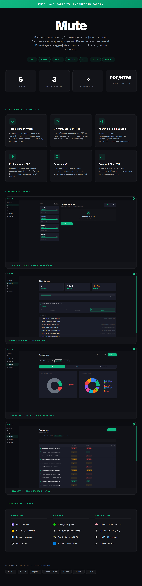

# 🎙️ MUTE

**SaaS Platform for Audio Transcription & AI Analytics**


> Upload audio → get instant transcription (Whisper) → receive AI-powered analytics and insights (GPT-4o) — all in a sleek dashboard with real-time progress tracking.

---


## 🎨 Project Presentation




## ✨ Key Features

### 🎧 Audio Transcription (Whisper)
Upload any audio file and get accurate transcription powered by OpenAI Whisper. Supports multiple languages and long-form audio with automatic chunking.

### 🧠 AI-Powered Analytics (GPT-4o)
Beyond transcription — MUTE analyzes your audio content. Get summaries, key topics extraction, sentiment analysis, and actionable insights automatically generated by GPT-4o.

### 📡 Real-time Processing (SSE)
Watch your audio being processed in real-time via Server-Sent Events. Progress bars, status updates, and results stream to the dashboard as they're generated — no page refreshing needed.

### 📊 Interactive Dashboard (Recharts)
Beautiful data visualizations built with Recharts. Track processing history, view analytics trends, and explore audio insights through interactive charts and graphs.

### 🔐 Multi-user Support
SQLite-backed user management with session handling. Each user has their own workspace with private transcription history and analytics.

---

## 🏗️ Architecture

```
┌─────────────────────────────────────────────────┐
│                Frontend (React 19)               │
│  Vite · Recharts · SSE Client · File Uploader   │
├─────────────────────────────────────────────────┤
│              Backend (Node.js + Express)          │
│  SSE Stream · File Processing · Queue Manager    │
├─────────────────────────────────────────────────┤
│                   AI Pipeline                    │
│  Whisper (Transcription) → GPT-4o (Analysis)    │
│  Chunking · Summarization · Sentiment           │
├─────────────────────────────────────────────────┤
│                  Data Layer                       │
│  SQLite · File Storage · Session Management      │
└─────────────────────────────────────────────────┘
```

---

## 🛠️ Tech Stack

| Layer | Technology |
|---|---|
| **Frontend** | React 19, Vite, Recharts |
| **Backend** | Node.js, Express |
| **AI** | OpenAI Whisper (STT), GPT-4o (NLP) |
| **Realtime** | Server-Sent Events (SSE) |
| **Database** | SQLite |
| **Audio** | FFmpeg processing pipeline |

---

## 🔒 Source Code

> **Note:** This repository serves as a portfolio showcase. The full source code is closed/commercial, but the architecture and implementation details can be reviewed upon request during technical interviews.
---

## 📄 License

MIT © 2026 [gajsin](https://github.com/gajsin)
